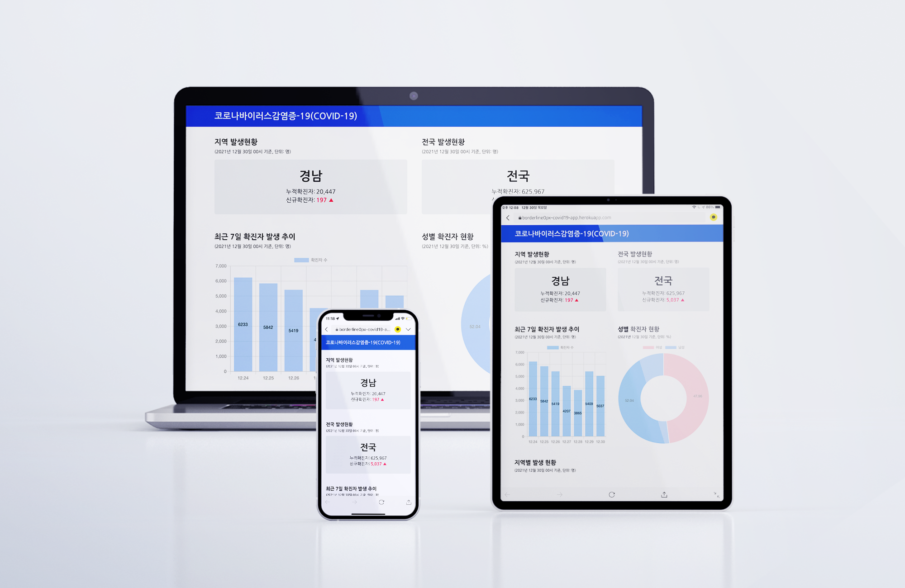

# COVID19 Info Page

공공데이터포털의 Open API를 활용하여 제작된 코로나 발생 동향 안내 페이지입니다.

📎 web page: [https://borderline0px-covid19-app.herokuapp.com/](https://borderline0px-covid19-app.herokuapp.com/)

## summary

- stack: React(CRA) hooks, styled-components, TypeScript, express, chart.js
- 공공데이터포털 Open API, Kakao Map API
- 반응형
- deployment: heroku
- 제작 동기: 서버와의 통신을 통해, 데이터 정보를 가져오는 것을 복습하기 위해 제작한 프로젝트입니다.

## 배운 점

- CORS 에러 해결: node.js의 express를 활용하여 직접 프록시 서버를 구축하여 배포했습니다.
- styled-components 활용: styled-components를 어떻게 하면 잘 활용할 수 있을지에 관해 고민이 많았습니다. props를 받아서 동적으로 property를 변경시킬 수 있다는 점을 상기하여, layout에 관한 컴포넌트와 typography, position 등에 관한 function을 만들었습니다.
- custom hooks 만들기: 서버와 통신하여 데이터를 받아오는 과정을 custom hooks로 만들어 보았습니다.
- TypeScript: React에서 TypeScript를 어떻게 적용할 수 있는지에 관하여 배울 수 있었습니다.

## 개선해야 할 사항

- 와이파이 환경에서만 지리 정보를 가져올 수 있는데 셀룰러 환경일 때도 가능하도록 만들기
- error 처리
- 모바일에서의 performance 향상시키기
- 사용자의 현재 위치 가져올 때의 로직에서 사용자 경험 높이기: 버튼을 통해 동의 구하기는 형식

---

<a href="https://kr.freepik.com/psd/mockup">Mockup psd는 syifa5610 - kr.freepik.com가 제작함</a>
